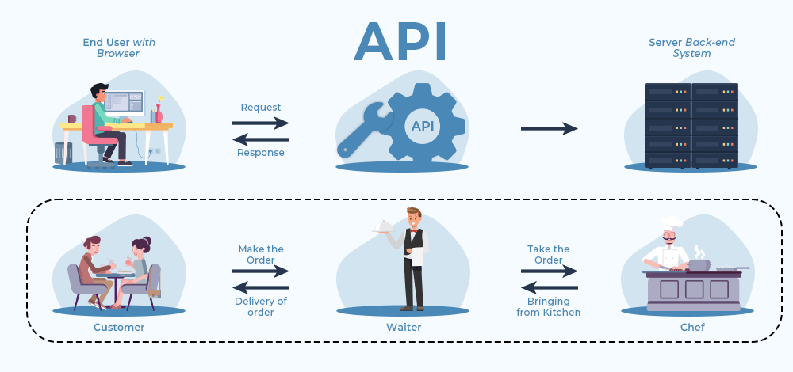

  

    Table of contents
  

  {: .text-delta }
 - TOC
{:toc}

# Module 1: What is AudiAnnotate?

What is AudiAnnotate? and, why is it being discussed in a workshop together with IIIF? Those are very valid questions! **Module 1** will show how these two digital tools are related and how they can be helpful during your research endeavours!

By the end of this module, you will be able to:

* Know what AudiAnnotate is
* Understand the use of AudiAnnotate in an academic setting

**Activity: Question**   When you see the word *annotate*, what do you think about? Is annotation restricted to written materials?
{: .note}

## Online Annotation

Annotation constitutes a fundamental element across various fields, including Digital Humanities. Annotation, in the realm of the Web, allows users to add, change, suggest or even remove information from a web-based material without modifying the resource itself.

Consider the annotations as an layer on top of a preexisting material, a layer that is usually visible for other users who share the same annotation system. In this sense, web annotation functions as a variant of social software tool.

An example of Web Annotation of a text material using the platform Scrible. Source: [Hongkiat.com](https://www.hongkiat.com/blog/top-web-annotation-and-markup-tools/)

Now, we frequently tend to associate online annotation with written works.  

In fact, given the advance of digital tools and the currrent omnipresence of audio and video in academia, annotation is now an action that we can perform on online materials beyond texts.   

This type of online annotationallows researchers, professors, students and the public to add, modify and share already-existing audio and video materials, thus enhancing and expanding the characteristics that the original material has. It allows to make the material more engaging to an outside audience through the scholars' added interpretation.

## AudiAnnotate 

AudiAnnotate is a project that aims to make audio or video materials and their annotations more accessible and usable for researchers and the public. This tool is a relatively straightforward and uncomplicated way to transform their analyses of audiovisual content into annotations.

It uses the [IIIF](https://mylovedsystem.github.io/IntrotoIIIF/content/Module1IIIF.html#module-1-what-is-iiif) v.3 standard and the W3C Web Annotation standard to create, publish, and share annotations on audio or video collections. 

## Why is AudiAnnotate helpful?

Annotating a text document is a basic activity that allows reviewers to give feedback on a Word document or a PDF document. However, <u>annotating audio and video files</u> is more difficult.

**AudiAnnotate** is a tool that lets you add annotation to audio or video files. It does this by linking the file with the comments in a sensible way. 

You can then share, present, and reuse the commented version with others, without changing the original file.

In addition to being **a digital tool**, it is helpful to think of the IIIF as **a community**.

Museums, educational archives, and libraries are taking part in this community, sharing their visual aids within one tool. IIIF calls this community the _**IIIF Consortium (IIIF-C)**_ 

*Some of the members of the IIIF Consortium. If you want to take a look at the full list of the consortium members, [click here](https://iiif.io/community/consortium/members/).*

 

Stemming from the Consortium members, the IIIF allows its users to **view images of artworks**, while also conducting various actions with/to the image. 

These capabilities include **enhanced zoom**, **color manipulation**, and **positioning images** next to one another for comparison purposes. In the compare-and-contrast function, the image quality remains unaltered. IIIF also allows the user to **annotate the image**. 

It is helpful to think of IIIF as a *set of standards* for sharing, viewing, comparing and manipulating images. 
{: .note}

## The IIIF Manifest

The IIIF functions as a repository of images (a virtual place where all the images are stored).
 
To achieve this function, IIIF relies on the **the Manifest**. 

The Manifest is the “package” which contains links to the resources that make up the image item. The Manifest takes the form of **a URL** that leads to an online document (in the format of JSON). Ultimately, the IIIF Manifest is the viewing object, itself. It is the object that is viewable through certain digital tools. 

**Definition of URL**   
Uniform Resource Locator. We can think of URLs as the website address that we enter into the search bar. For example: https://ubc-library-rc.github.io
{: .note}

For the purposes of this module, it is important to understand that **the JSON can be read and displayed by IIIF**. 
 
### IIIF Manifest Viewers 

There are at least a dozen tools to view the IIIF Manifest that perform different tasks and have different users. Some of the most-widely known and used viewers are:

* Mirador
* Universal Viewer (UV)
* Tify
* IIIF Curation Viewer 
* Diva.js. 

In a later part of this module, we will be engaging with Mirador, probably the most-well known IIIF viewer. 

## The Four APIs of IIIF

The IIIF has four main [**APIs**][id1] :

[id1]: ## "Application Programming Interface, we can think of APIs as software that transmits information between a user and a website/app"

<!-- Identifiers, in alphabetical order -->

[another-identifier]: https://www.altexsoft.com/blog/engineering/what-is-api-definition-types-specifications-documentation/
"Application Programming Interface, we can think of APIs as software that transmits information between a user and a website/app"

1. **The image**: comprised of **pixels**.
2. **Presentation**: how the image is presented to the viewer, it will be presented in a format that is **highly viewable** (in other words, a reasonable size, not difficult to see).
3. **Authentication**: the IIIF has certain restrictions in place to ensure there is a standard underlying the image presentation; this permits a standard of trust for users (in other words, the image you are seeing is **an accurate representation of the artwork**; this is particularly useful for **art students** as they may encounter images online that have been doctored or photoshopped, leaving students uncertain of the accuracy of the image).
4. **Search**: there are search functions on the image, for instance those permitting the user to s**earch the annotations of the images** and images involving text)

 

**What's an API?**  

*What is an API (Application Programming Interface)? Source: [https://www.geeksforgeeks.org](https://www.geeksforgeeks.org)*
{: .note}
 
---

In summary, the IIIF is a digital tool that allows users to **view**, **compare** and **manipulate** images, with an added layer of authenticity (trust). 
