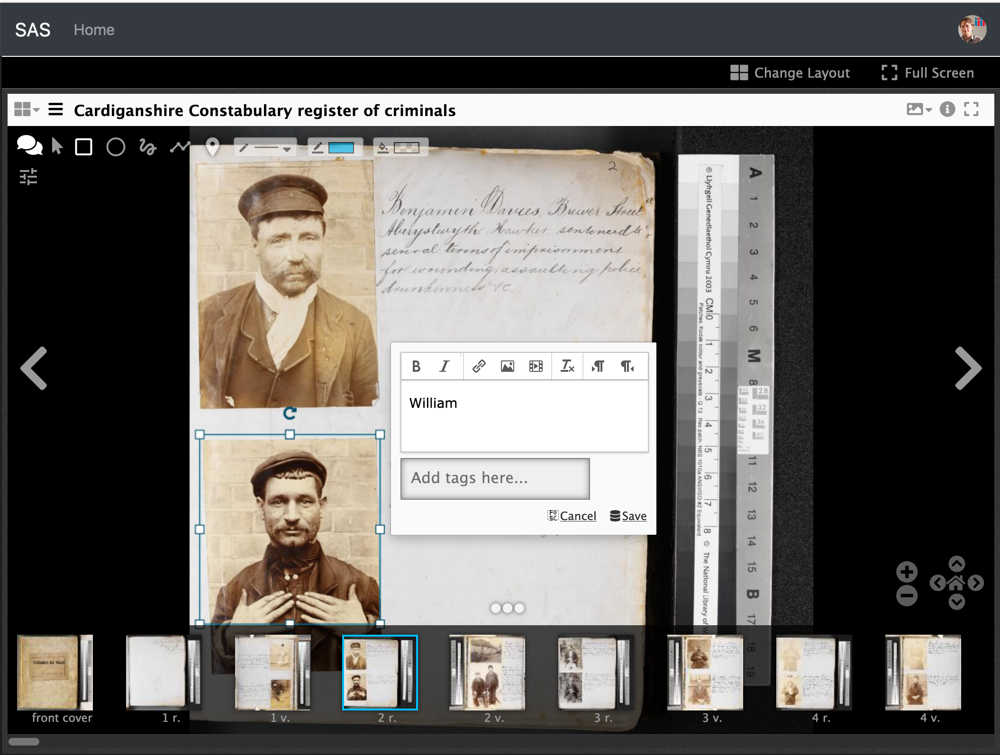
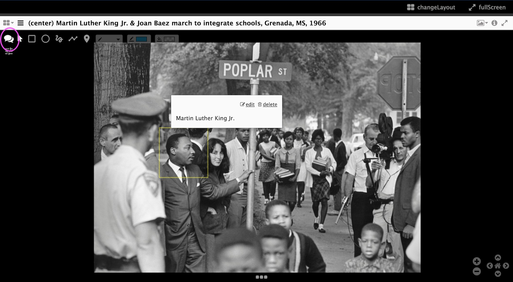

  

    Table of contents
  

  {: .text-delta }
 - TOC
{:toc}

# Module 2: How to use AudiAnnotate?

Now that we know what online annotation is, how it is possible to annotate audiovisual materials and how AudiAnnotate can be helpful in doing that, let us explore how to use this digital tool.

By the end of this module, you will be able to:

*  Follow the necessary steps to use AudiAnnotate
*  Create a new project
*  Obtain a shareable GitHub repository containing your annotated version of the audivisual material

## Using AudiAnnotate

Please create a [GitHub](https://github.com/){:target="_blank"} account if you don’t already have one.
{: .prereq}

To use AudiAnnotate, follow these steps:

### Log in on AudiAnnotate and Create a New Project

1. Go to the [AudiAnnotate application](http://audiannotate.brumfieldlabs.com){:target="_blank"}
2. On the top right corner, click on **Sign in** to access the application with your GitHub account
   

3. GitHub will ask you to authorize AudiAnnotate to use your GitHub account. Click on the **Authorize** green-coloured button and then enter your password.
4. You should land on a page with the following icon as the only content. Click on **New Project**

5. You will be asked to create a title, a project description and a project slug (the project's GitHub repository name). Fill out the boxed and click on **Create Project**

This project will be hosted in your personal GitHub as a repository so you have the full access.

### Create an Audiovisual Item

1. In the project you just created, click on **Create Item Manifest**
2. AudiAnnotate will ask you to add metadata associated with your project’s audio. Paste the link of your <b>video or audio file</b> in the `​​Audio File URL` field

If you have a file on your computer, but not a URL, upload it to a file-hosting site like [**The Internet Archive**](https://archive.org/){:target="_blank"} or [**Box**](https://box.com/){:target="_blank"}  in order to generate a URL for it. 
AudiAnnotate supports direct links to:
**Audio**: HTML: MP3, WAV, and OGG.
**Video**: MP4, WebM, and Ogg
Make sure these files do not contain sensitive data or information that you do not want to publicize. Open resources like [**The Internet Archive’s Audio Archive**](https://archive.org/details/audio){:target="_blank"} are recommended. 
{: .note} 

Name this item in the `Label` field
Save

IIIF has become **a large digital repository** that allows for **uniform access** to the images that are hosted in the various sites (Consortium members) that cooperate with IIIF. 
 
Per a document prepared by the **UBC School of Library, Archival and Information Studies** (November 2017), IIIF’s “main value consists in enabling collaboration with other institutions and making possible **linked data initiatives**.” 

### Image Annotation with IIIF
 
One of the most valuable features of IIIF is **image annotation **.

In other words, you can make notes on the image while you are viewing the image. This includes:

*       The ability to draw directly on the image
*       In an oval, rectangular, freeform, or polygonal shape (size and dimensions determined by the user), you can write text within that created shape
*       The text can be bold, italic, or set to a colour; text can be indented to the left or right 
*       The ability to embed another image/media or link directly into the annotation 
*       The annotation can be given a fill colour 

*Example of image annotation using IIIF's Simple Annotation Server (SAS). Source: [https://training.iiif.io](https://training.iiif.io)*

## The Utility of IIIF In Classroom Teaching and Presentations

The uses of IIIF in the classroom setting are diverse. Particularly through the **Mirador viewer** (which will be discussed in Module 3), IIIF has great utility in classroom teaching involving visual arts. 
 
### Annotation

In terms of presenting an image of an artwork on a projector to the class, the instructor can **use IIIF to annotate the image** (identify areas of interest, relay notes etc.) 

*Example of image annotation using IIIF's Mirador viewer. Source: [https://iiif-ml-workshop.netlify.app](https://iiif-ml-workshop.netlify.app)*

### Compare and Contrast

IIIF via the Mirador viewer is also quite useful for **comparing and contrasting images**, which is a common form of slide presentation in Art History and other art-related disciplines. 

This method of visual presentation is valuable not only for teaching (showing two images side by side), but **also for learning assessment** (such as a slide comparison during a final exam). 

*Example contrasting two versions of Van Gogh's The Bedroom using IIIF's Mirador. Source: [https://www.gallerysystems.com/iiif-what-is-it-and-what-does-it-do/](https://www.gallerysystems.com/iiif-what-is-it-and-what-does-it-do/)*

---

In summary, the utility of IIIF encompasses both teaching and learning. 
